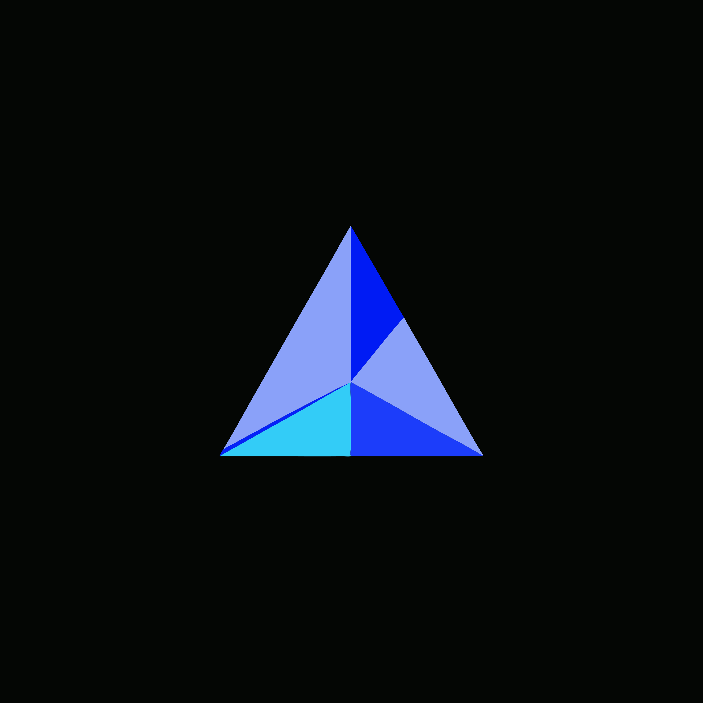

<p align="center">
  
</p>

# Lumen

Lumen is a markup-first UI framework for native desktop apps.

You describe the interface in `.lmn` markup, style it in CSS, and drive it with
a script. The result is a native application on Linux, macOS, and Windows,
drawn on the GPU. Reach for it when you want a desktop app that looks and
behaves like one, and you would rather write markup and CSS than assemble
widgets in code. It is not a browser: there is no DOM engine, no JavaScript
runtime, and no web view.

## Quick start

Install the toolchain:

```sh
curl -fsSL https://lumenfx.dev/install.sh | sh
```

On Windows, run the per-user installer from the
[latest release](https://github.com/lumen-fx/lumen/releases/latest/download/lumen-windows-x86_64.msi).

Then scaffold an app and run it:

```sh
lumenc new my-app counter
lumenc run my-app
```

`my-app/main.lmn` is the whole interface:

```html
<root bg="#0c1c30" padding="32" gap="20" align="center" justify="center">
  <label class="display" id="counter" width="100%" height="120px" text="0"
         bind-text="clicks" />
  <row gap="14" justify="center">
    <button class="primary" id="bump"  width="120px" height="48px" text="+1" />
    <button class="primary" id="reset" width="120px" height="48px" text="reset" />
  </row>
  <script src="main.cdl" />
</root>
```

The script writes a `clicks` value and the label follows it. Edit any file while
the app runs and the window updates.

## What it does

- **Markup and layout.** Containers, text, images, and the usual controls:
  buttons, text fields, toggles, sliders, checkboxes, radios, progress bars,
  tabs, dropdowns, menus, dialogs, tooltips, and scrollable regions. Flexbox,
  with CSS grid where it fits better.
- **CSS you already know.** Selectors, the cascade, pseudo-classes, custom
  properties, transitions, and platform skins.
- **Reactive by default.** Named signals hold state; `bind-*`, `<for>`, and
  `<if>` keep the UI in step. Writing a signal is the whole update.
- **Scripting in candela, Rhai, or Lua.** The file extension picks the host.
- **Multi-page apps.** Every `.lmn` file is a page, reachable by its filename,
  with `<a href>` links.
- **The desktop around your app.** Menus, tray icons, notifications, global
  hotkeys, file dialogs, clipboard, drag and drop, audio, and accessibility
  through AccessKit.
- **Tooling.** One command to create, check, format, run, and package. A
  headless mode runs the full pipeline with no window, so a UI can be driven
  and screenshotted from CI.

## Limitations

Lumen is in alpha, and APIs can change between releases. An app has one window.
There is no web, iOS, or Android target. The CSS is a subset of the web's,
aimed at application UI. An app runs one script host at a time.

## Documentation

Full documentation is at [docs.lumenfx.dev](https://docs.lumenfx.dev): getting
started, task guides, and a complete reference for the markup, CSS, config, CLI,
and scripting surfaces.

Contributions are welcome; see [CONTRIBUTING.md](CONTRIBUTING.md).

## License

Mozilla Public License 2.0. See [LICENSE](LICENSE).
